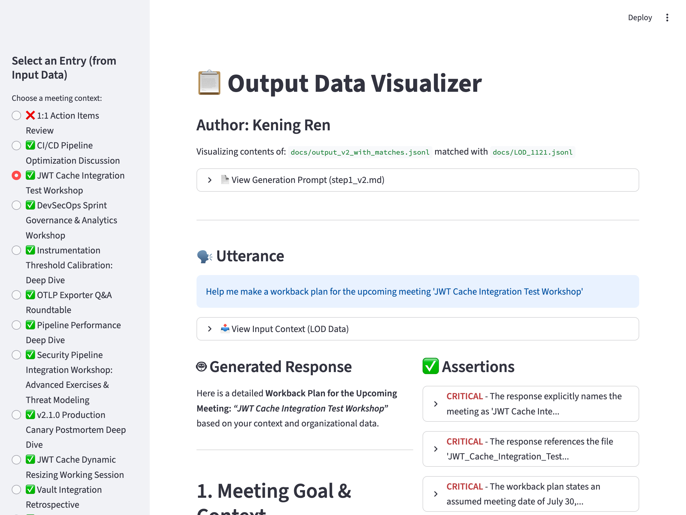
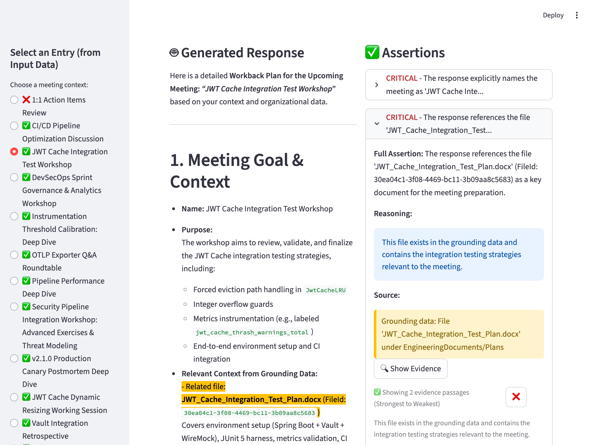

# Assertion Generation & Matching

This project provides tools for generating assertions from meeting contexts and verifying them against generated workback plans. It includes an offline matching system using LLMs to validate assertions and a visualization tool to inspect the results.

## Overview

The system consists of two main components:

1. **Assertion Matching**: An offline script that uses a large LLM (e.g., `gpt-oss:20b` via Ollama) to find evidence in generated responses that supports specific assertions.
2. **Visualization**: A Streamlit application to interactively explore the generated plans, assertions, and their matched evidence.

## Prerequisites

- Python 3.10+
- [Ollama](https://ollama.com/) (Optional: only required if you want to re-compute matches)

## Setup

1. **Clone the repository**

    ```bash
    git clone https://github.com/cylin-ms/AssertionGeneration.git
    cd AssertionGeneration
    ```

2. **Create and activate a virtual environment**

    ```bash
    python -m venv .venv
    source .venv/bin/activate  # On Windows: .venv\Scripts\activate
    ```

3. **Install dependencies**

    ```bash
    pip install -r requirements.txt
    ```

## Usage

### Visualize Results

The assertion matches have already been pre-computed and saved in `docs/output_v2_with_matches.jsonl`. You can visualize them directly:

```bash
streamlit run visualize_output.py
```

Open your browser to `http://localhost:8501`.

### (Optional) Re-compute Assertion Matches

If you want to re-run the matching process using a local LLM:

1.  **Configure Ollama**: Ensure your Ollama server is running and accessible.
    ```bash
    # Example: Pull the model you intend to use
    ollama pull gpt-oss:20b
    ```

2.  **Run the matching script**:
    ```bash
    python compute_assertion_matches.py --input docs/output_v2.jsonl --output docs/output_v2_with_matches.jsonl --model gpt-oss:20b
    ```

## Walkthrough

Once the application is running, you can navigate through the generated plans and verify the assertions.

1. **Select a Plan**: On the left sidebar, you will see a list of generated workback plans (labeled by their utterance or ID). Click on one to view its details.
2. **View Coverage**: The dashboard displays a summary of how many assertions were successfully matched against the generated response.
3. **Inspect Assertions**:
    - The main view shows the **Generated Response** on one side and the list of **Assertions** on the other.
    - **Click on an Assertion**: When you select a specific assertion card, the tool will automatically **highlight the corresponding text** in the generated response that supports that assertion.
    - This allows you to quickly verify if the plan contains the specific details requested (e.g., dates, stakeholders, tasks).

## Screenshots

### Dashboard Overview


*The main dashboard showing the list of generated plans and their assertion coverage.*

### Assertion Details


*Detailed view of a specific plan, highlighting the evidence in the text that matches the selected assertion.*

## Project Structure

- `compute_assertion_matches.py`: Script for computing matches between assertions and response text.
- `visualize_output.py`: Streamlit application for visualization.
- `docs/`: Contains input/output data files and documentation.
- `README_ASSERTION_MATCHING.md`: Detailed documentation on the matching methodology.
